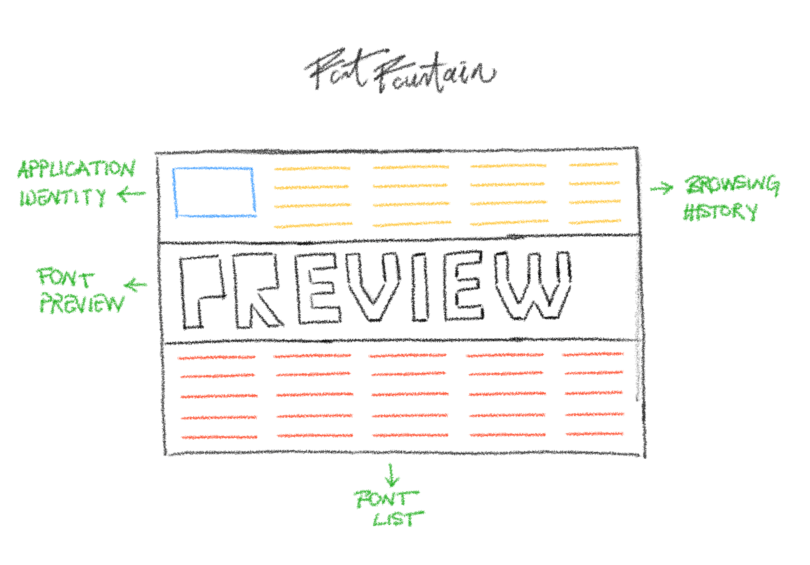

  # Font Fountain

  <h3 align="center">Project Specification</h3>

 

Contents

<ol>
  <li><a href="#the-project-what-and-why">The Project: What and Why?</a></li>
  <li><a href="#requirements">Requirements</a></li>
  <li><a href="#installation-and-submission">Installation and Submission</a></li>
  <li>
    <a href="#assessment">Assessment</a>
    <ol>
      <li>
        <a href="#architecture">Architecture</a>
        <ul>
          <li>Abstractions</li>
          <li>User Experience</li>
          <li>Interaction Design</li>
          <li>Information Architecture</li>
        </ul>
      </li>
      <li><a href="#visual-design">Visual Design</a></li>
      <li><a href="#engineering">Engineering</a></li>
      <li>
        <a href="#implementation">Implementation</a>
        <ul>
          <li>Complexity</li>
          <li>Nomenclature</li>
          <li>Comments</li>
          <li>Handling Exceptions</li>
          <li>Performance</li>
        </ul>
      </li>
    </ol>
  </li>
  <li><a href="#faq">FAQ</a></li>
  <li><a href="#your-notes">Your Notes</a></li>
</ol>

## The Project: What and Why?
Font Fountain is an application for quickly browsing among a predefined set of fonts to make simple judgments based on the appearance of the fonts.

Fonts show up in the "preview" area in a much bigger font size when they are selected, compared to the font size of the list of the fonts for browsing.

The application allows users to change the placeholder text in the preview area by typing on the keyboard to make it possible to visually assess
combinations of glyphs in a font.

But, it also supports a unique feature for changing the placeholder text, without typing on the keyboard.

## Requirements

1. The application should run without errors.
2. The application should have an identity of its own, designed by you. You should give in a one-to-three sentences description of your design choices on the application's identity.
3. You should pick a number of fonts between 50-100 from fonts.google.com as per your artistic tastes. You should give in a one-to-three sentences description of your collection's merits.
4. You should include the fonts as CSS @font-face at-rules locally.
5. The user should be able to browse among the fonts. Font browser should list the fonts in their own type faces (e.g. "Courier" item in the list should appear in the Courier type face).
6. Selecting a font in the browser should bring the font up into the preview area with a much bigger font size which is up to you.
7. Preview area should present the selected font with a placeholder text which you can specify freely. You should give in a one-to-three sentences justification of your selection of the default placeholder text.
8. Preview area should enable an interaction for changing the placeholder text by typing on the keyboard.
9. Preview area should support the Glyph Rounding feature which is explained as follows: The letter under the cursor is incremented/decremented by one letter at a time on mouse wheel movement. Opposing directions of movement should result in opposite interactions.
   Incrementing by one letter means replacing the current letter with the one just after it in the alphabet. Decrementing by one letter means replacing the current letter with the one just before it in the alphabet. 
   The alphabet being: "a, b, c, d, e, f, g, h, i, j, k, l, m, n, o, p, q, r, s, t, u, v, w, x, y, z, A, B, C, D, E, F, G, H, I, J, K, L, M, N, O, P, Q, R, S, T, U, V, W, X, Y, Z" in cyclic order. So, before "a" is "Z" and after "Z" is "a".
10. There should be a way of browsing in the previous font preview history. Which has the same functionalities as the font browser except changing the preview history.
11. The application should be written in plain JavaScript ES6, HTML5 and CSS3 without any external package dependencies.

## Installation and Submission
You can start working on the project by cloning this repository and entering into the "Font Fountain" directory.
Then, issue `npm ci` which will install dependencies for the development. Running `npm run dev` will bootstrap the application, welcoming you with a quote from Edsger W. Dijkstra.

### Submission
You are expected to submit your work as a single `zip` file alongside with all of the original files in their original file structure as they are provided to you.
So, do not delete any files or directories.

Please name your `zip` file using the template `ff_<name>_<surname>.zip` and send it to `hr@technarts.com` with an appropriate subject. Humans will read it.

Some of the requirements above asks from you some written answers. You should place them at the end of this README.md file.
Anything you want to convey to us about your implementation can also be placed at the end of this README.md file.

## Assessment
We want to assess multiple aspects of your skills. You are not expected to be perfect.
But you are expected to show your sense of quality by paying attention to:

### Architecture
Of your realization of this project. We will seek for well-thought abstractions, carefully designed user experiences.
We take notice when we see cleverly opened paths for interactions to occur almost naturally and we have an eye on information findability and understandability.

### Visual Design
You should show your sense of "beautiful" in a purposeful manner so that your visual design choices make sense.

### Engineering
What tools you invent, use and reuse to make yourself able to implement the project is extremely important.

### Implementation
Your code should be open to extensions. In a code base, where there are unnecessary complexities, this is tough job.

Your choices of names for variables, functions, classes etc. should reflect your architectural design.

Comments will help us understand when things get hot.

How do you handle exceptions? More importantly, what do you consider as an exception in your implementation?

Your implementation should work without performance issues on a moderate hardware which is more than necessary for this project's requirements.

## FAQ
Here are some self-answered questions that may help.

### I hate this kind of stuff. Why are you taking my precious time?
Yes, I understand you and respect your attitude on this.
But our experiences taught us that unless you see somebody on the job, way more precious times get lost. This should also be understandable on your behalf.
Maybe you can think of this as an opportunity to tackle with a well defined problem.

### Alright. I accept the challenge. But you completely lost me, I haven't even the vaguest sense of what to do.
Well, if you accept the challenge, you are expected to write the JavaScript, HTML and CSS codes for the application described in the <a href="#requirements">Requirements</a> section.
When we run `npm run dev` we should be seeing an application about fonts. Which is there to help facilitate font selection by providing a preview functionality with the unique feature of Glyph Rounding.

### Nope. Still lost. Any help?
Alright, here is an example layout for you. You can use it to realize the project. It is described in a very high level fashion:

### That "Glyph Rounding" thing gets on my nerves. Can I refuse to implement that feature?
We do not recommend not implementing that feature because it is the juicy part of the project.
Nevertheless, your submission will still be considered without it, if it is the only thing missing.

## Your Notes

